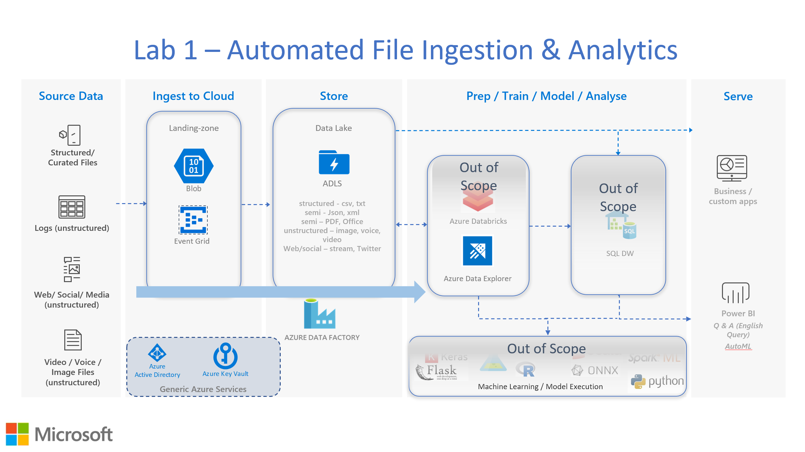

Lab 1: Automated File Ingestion & Analytics

Lab Summary
-----------

Land files at scale (to a maximum of 100 per second) to Azure Blob,
triggering automatic file ingestion into ADLS Gen-2. File ingestion is
triggered via blob create events that Azure Event Grid detects and calls
a parameterised ADF pipeline. In this lab data will be queried via an
external table reference from ADX to ADLS**\*\*.** In subsequent labs
data will be ingested into ADX.

This solution architecture provides support for data ingestion for both
structured and semi-structured data. Demo data is based on simplistic
JSON documents to demonstrate concepts. The first five lab activities
are associated with building the environment that will be used in this
lab. Activities 6 & 7 build and execute an ADF pipeline associated with
the file ingestion to ADLS. Activity 8 provides an example of dynamic
analytics with data residing in ADLS via an external table reference. As
mentioned, this is based off a small set of simulated JSON quotation
records.

This **README.MD** file explains how the lab is structured, what you
will learn, and the technologies you will use in this solution.

Activities
----------

The lab is broken down into several logical units, as follows:

-   Activity 1: Azure Blob, Azure Data Lake (ADLS)

    -   Build these Azure services

-   Activity 2: Key Vault, Event Grid

    -   Build these Azure services

-   Activity 3: Data Factory

    -   Build these Azure services

-   Activity 4: Azure Data Explorer (ADX)

    -   Build these Azure services

-   Activity 5: Security & Access

    -   Configure storage SAS keys

-   Activity 6: ADF Pipeline

    -   Build an ADF pipeline, triggered by Event Grid

-   Activity 7: Execute ADF Pipeline

    -   Run the ADF pipeline with sample data

-   Activity 8: ADX integration with ADLS

The first five activities are associated with building the environment
that will be used in this and subsequent labs. Lab activities 6 & 7
build and execute an ADF pipeline associated with automated file
ingestion. Lab activity 8 gives a summary example of dynamic analytics
with data residing in a data lake.

Architecture
------------

The diagram below shows the architecture that will be built in Lab 1.

Method
------

Open the lab document "Azure Cloud Scale Analytics with ADX - Lab 1
Instructions.pdf" and work through each activity to complete the lab.

**\*\*** *ADX has a highly performant architecture for analysis of data
that is achieved via memory and SSD based caching. To achieve this
performance data is ingested into the ADX cluster(s) in either a batch
or real-time manner (both forms of ingestion will be covered in future
labs).*

*The external table reference does not ingest data into the ADX cluster
-- rather the data resides on Azure Blob or Azure ADLS, i.e. external to
the cluster. As such, external table queries are not as performant due
to the lack of caching and are ideal in use-cases were "what if "or
point-in-time analysis is required. This is commonly on smaller sets of
data or when it is not operationally efficient to ingest all data into
ADX. Such use-cases could be:*

-   *average volume/quote/valuations in a period (intra-day, hours)*
