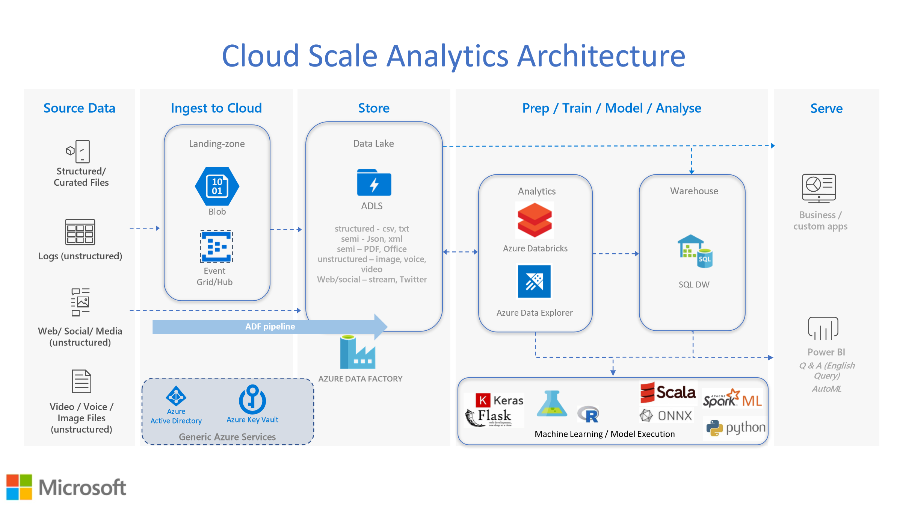

About this workshop
===================

Welcome to this Azure Data Explorer (ADX) solutions workshop(s).

In this workshop you will learn how to solve modern data challenges with
ADX using a hands-on activity approach.

This workshop is intended to be taken as a self-paced or instructor-led
lab.

This workshop is designed for data professionals who have a basic
working knowledge of Microsoft Azure, Analytics and Cloud computing. It
is designed around the Azure portal to allow uptake by all Azure users
regardless of their skills with PowerShell, CLI, etc.

This **README.MD** file explains how the workshop is structured, what
you will learn, and the technologies you will use in this solution.

Introduction
============

Simplistically, [Azure Data Explorer
(ADX)](https://azure.microsoft.com/en-us/services/data-explorer/) is an
Azure Cloud service for storing and running interactive analytics over
Big Data.

ADX is a fast, fully managed data analytics service for real-time
analysis on large volumes of streaming data (e.g. websites and IoT
devices) or batch/data at rest (e.g. Data Lake). You can employ ADX to
collect, store, and analyse data for the purpose of identifying
patterns, anomalies, enhance customer experiences, monitor devices, and
boost operational performance.

Purpose
=======

The main purpose of this workshop is to help educate and build awareness
around ADX deployment within your solution architectures. Secondly, the
intention is to also offer artefacts that can:

> \(a) be utilised to quickly deploy a set of Azure services that utilise
> ADX within your subscription, and
>
> \(b) help educate how ADX can be deployed within numerous architectural
> scenarios to address analytical use cases for data at rest or streaming
> data.

Over time this workshop and, hence, solution architectures, will grow as
labs are added. The core lab "Lab1" will remain applicable to many of
these architectures.

Content
=======

The workshop labs have been designed to enable you to work through each
section in a step by step basis with the view to producing a working
solution architecture according to the lab.

Each lab will have a high-level architectural diagram. For Lab1, the
document is "Azure Cloud Scale Analytics with ADX - Lab1.pdf". Each
Activity in a lab will also have a high-level architectural diagram,
identified at the start of each activity section.

Lab1 has been written in a click-by-click style to encourage familiarity
with the Azure Portal. Subsequent labs will be more script based.to use
the Azure portal. Labs will introduce scripts (whether PowerShell or ARM
templates) but all will utilise the portal in the first instance.

Background Reading
==================

The following links will help with the understanding of ADX Cloud Scale
Analytics and Cloud based architectures.

For an in depth look that the ADX product, the
[whitepaper](https://azure.microsoft.com/en-us/resources/azure-data-explorer/)
can be referenced.

James Serra has a great blog and this
[article](https://www.jamesserra.com/archive/2019/03/azure-data-explorer/)
provides an excellent high level summary of ADX.

To understand
[KQL](https://docs.microsoft.com/en-us/sharepoint/dev/general-development/keyword-query-language-kql-syntax-reference),
the query language used in ADX, this [Pluralsight
course](https://www.pluralsight.com/courses/kusto-query-language-kql-from-scratch)
is an excellent facilitator.

Cloud Scale Analytics Architecture
==================================

The feature rich and diverse number of Azure Data Services creates a
plethora of permutations for an Azure based architecture that is
appropriate to your requirements. For these labs, the following
architectural diagram will be generically used. Any Azure services that
are specific to each lab will be shown on a lab relevant diagram.

Other Azure services may be added to this workshop and the architecture
diagram, and resulting number of labs, will change accordingly.

{width="6.268055555555556in"
height="3.5430555555555556in"}

Core Azure Services
===================

In this workshop, and through the series of labs, the following Azure
services are commonly used. These are identified here:

[Azure Key Vault](https://azure.microsoft.com/en-us/services/key-vault)

[Azure Blob
storage](https://azure.microsoft.com/en-gb/services/storage/blobs/?&OCID=AID2000125_SEM_NLGqblqc&MarinID=NLGqblqc_79164918425499_azure%20blob%20storage_be_c__1266637735603846_kwd-79165081757877:loc-188&lnkd=Bing_Azure_Brand&msclkid=4db52d3c66491ef9feb0709dca602300&ef_id=XZ4wjAAAAD516UzT:20191012103421:s&dclid=CN-nnezCluUCFSMh0wodlHQDRg)

[Azure Data Lake
(ADLS)](https://docs.microsoft.com/en-us/azure/storage/blobs/data-lake-storage-introduction)

[Azure Data Explorer
(ADX)](https://azure.microsoft.com/en-gb/services/data-explorer/)

All services may not be used in an individual lab. Familiarity with
these Azure service is beneficial.

Subscription
============

You will need an Azure subscription into which the services identified
in a lab can be created.

[Option 1]{.underline} - Microsoft Developer Network Account (MSDN)
Account

The best way to take this workshop is to use your Microsoft Developer
Network (MSDN) benefits if you have a subscription.

Open this resource and click the \"Activate your monthly Azure credit\"
button. If you don\'t have an Azure subscription, create a [free Azure
account](https://azure.microsoft.com/free/) before you begin.

[Option 2]{.underline} - Use Your Own Account

You can also use your own account or one provided to you by your
organization, but you must be able to create a resource group and
create, start, and manage a the Azure services as mentioned in 'Core
Azure Services' above.

Labs
====

This workshop will comprise several labs that will increase over time.
Labs will introduce different analytical scenarios, all using Azure Data
Factory (ADX), but will incorporate different architectural patterns to
give an understanding of implementation scenarios. Such architectural
patterns will include streaming data, automated file ingestion,
geographical data, handling data in varying formats and Machine Learning
(ML).

The first lab \[*Lab1 -- Automated File Ingestion & Analytics*\] is
aimed at organisations that have large batch schedules with numerous
upstream data producers and downstream data consumers.

-   Financial Services (Banking, Insurance)

-   IoT - manufacturing (process monitoring)

-   IoT -- automotive (black box/traffic monitoring)
