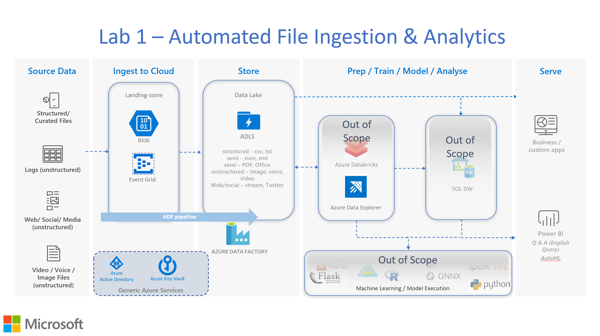

About this workshop 
====================

Welcome to this Azure Data Explorer (ADX) solutions workshop(s).

In this workshop you will learn how to solve modern data challenges with
ADX using hands-on activities.

This workshop is intended to be taken self-paced or via an
instructor-led event.

This workshop is designed for data professionals who have a basic
working knowledge of Microsoft Azure, Analytics and Cloud computing. It
is designed around the Azure portal to allow uptake by all Azure users
regardless of their skills with PowerShell, CLI, etc.

This **README.MD** file explains how the workshop is structured, what
you will learn, and the technologies you will use in this solution.

Introduction
============

Simplistically, [Azure Data Explorer
(ADX)](https://azure.microsoft.com/en-us/services/data-explorer/) is an
Azure Cloud service for storing and running interactive analytics over
Big Data.

ADX is a fast, fully managed data analytics service for real-time
analysis on large volumes of streaming data (e.g. websites and IoT
devices) or batch data (data at rest). You can employ ADX to collect,
store, and analyse data for the purpose of identifying patterns,
anomalies, enhance customer experiences, monitor devices, and boost
operational performance.

Purpose
=======

The main purpose of this workshop is to help educate and build awareness
around ADX deployment within solution architectures. Secondly, also
offer artefacts that can:

-   be utilised to quickly deploy a set of Azure services that utilise
    ADX within your subscription, and,

-   help educate how ADX can be deployed within architectural scenarios
    to address analytical use cases for data whether the data is at
    batch or streaming.

Over time this workshop, and hence solution architectures, will grow as
labs are added. The core lab "Lab1" will remain applicable to many of
these architectures.

Content
=======

The labs have been designed to enable you to work through each section
in a step by step basis with the view to producing a working solution
architecture at the end of each lab.

Each lab will have a high-level architectural diagram, e.g. for Lab1
this is "Azure Cloud Scale Analytics with ADX - Lab1.pdf", that will be
identified at the start of each activity section.

Lab1 has been written in a click-by-click style to encourage familiarity
with the Azure Portal. Subsequent labs will be more script based.to use
the Azure portal. Labs will introduce scripts (whether PowerShell or ARM
templates) but all will utilise the portal in the first instance.

Background Reading
==================

The following links will help with the understanding of ADX and Cloud
based architectures.

For an in depth look that the ADX product, the
[whitepaper](https://azure.microsoft.com/en-us/resources/azure-data-explorer/)
can be referenced.

James Serra has a great blog and this
[article](https://www.jamesserra.com/archive/2019/03/azure-data-explorer/)
provides an excellent high level summary of ADX.

To understand
[KQL](https://docs.microsoft.com/en-us/sharepoint/dev/general-development/keyword-query-language-kql-syntax-reference),
the query language used in ADX, this [Pluralsight
course](https://www.pluralsight.com/courses/kusto-query-language-kql-from-scratch)
is an excellent facilitator.

Cloud Scale Analytics Architecture
==================================

The feature rich and diverse number of Azure Data Services creates a
plethora of permutations for an Azure cloud-based architecture that is
appropriate to your requirements. For these labs, the following
architectural diagram will be generically used:

Core Azure Services
===================

In this workshop, and through the series of labs, the following Azure
services will be deployed. Not all of these Azure services will be used
in each lab, however, a number of them are commonly utilised. As such,
familiarity with the following Azure services is beneficial for this
workshop and Azure Cloud Analytics Architectures:

> [Azure Key
> Vault](https://azure.microsoft.com/en-us/services/key-vault)
>
> [Azure Blob
> storage](https://azure.microsoft.com/en-gb/services/storage/blobs/?&OCID=AID2000125_SEM_NLGqblqc&MarinID=NLGqblqc_79164918425499_azure%20blob%20storage_be_c__1266637735603846_kwd-79165081757877:loc-188&lnkd=Bing_Azure_Brand&msclkid=4db52d3c66491ef9feb0709dca602300&ef_id=XZ4wjAAAAD516UzT:20191012103421:s&dclid=CN-nnezCluUCFSMh0wodlHQDRg)
>
> [Azure Data Lake
> (ADLS)](https://docs.microsoft.com/en-us/azure/storage/blobs/data-lake-storage-introduction)
>
> [Azure Data Explorer
> (ADX)](https://azure.microsoft.com/en-gb/services/data-explorer/)

[Azure Data Factory
(ADF)](https://azure.microsoft.com/en-us/services/data-factory/)

[Azure Event
Grid](https://azure.microsoft.com/en-us/services/event-grid/)

Any Azure services that are specific to each lab will be identified on
an associated lab related architecture diagram and in the accompanying
lab documentation.

Other Azure services may be added to this workshop and the architecture
diagrams, and resulting number of labs, will change accordingly.

All services may not be used concurrently in an individual lab.

Subscription
============

You will need an Azure subscription into which the services identified
in a lab can be created.

> **Option 1** - Microsoft Developer Network Account (MSDN) Account
>
> The best way to take this workshop is to use your Microsoft Developer
> Network (MSDN) benefits if you have a subscription.
>
> Open this resource and click the \"Activate your monthly Azure
> credit\" button. If you don\'t have an Azure subscription, create a
> [free Azure account](https://azure.microsoft.com/free/) before you
> begin.
>
> **Option 2** - Use Your Own Account
>
> You can also use your own account or one provided to you by your
> organization, but you must be able to create a resource group and
> create, start, and manage a the Azure services as mentioned in 'Core
> Azure Services' above.

Labs
====

This workshop will comprise several labs that will increase over time.
Labs will introduce different analytical scenarios, all using Azure Data
Factory (ADX), but will incorporate different architectural patterns to
give an understanding of implementation scenarios. Such architectural
patterns will include streaming data ingestion, batch data ingestion,
automated file ingestion, geographical data, handling data in varying
formats and Machine Learning (ML).

The architecture can easily be enhanced to include additional Azure
services, such as, structured/relational datastores (SQL Server,
PostgreSQL) or semi-structured/non-relational datastores (e.g. Cosmos
DB).

The first lab ***Lab1 -- Automated File Ingestion & Analytics*** is
aimed at organisations that have large ***batch*** schedules with
numerous upstream data producers and downstream data consumers, e.g.
Financial Services (Banking, Insurance)

Lab 1: Automated File Ingestion & Analytics
===========================================

Lab Summary
-----------

Land files at scale (to a maximum of 100 per second) to Azure Blob,
triggering automatic file ingestion into ADLS Gen-2. File ingestion is
triggered via blob create events that Azure Event Grid detects and calls
a parameterised ADF pipeline. In this lab data will be queried via an
external table reference from ADX to ADLS *(see note 1).* In subsequent
labs data will be ingested into ADX.

This solution architecture provides support for data ingestion for both
structured and semi-structured data. Demo data is based on simplistic
JSON documents to demonstrate concepts. The first five lab activities
are associated with building the environment that will be used in this
lab. Activities 6 & 7 build and execute an ADF pipeline associated with
the file ingestion to ADLS. Activity 8 provides an example of dynamic
analytics with data residing in ADLS via an external table reference. As
mentioned, this is based off a small set of simulated JSON quotation
records.

Lab 1: Architecture
-------------------

The diagram below shows the architecture that will be built in Lab 1.

***(note 1)** ADX has a highly performant architecture for analysis of
data that is achieved via memory and SSD based caching. To achieve this
performance data is ingested into the ADX cluster(s) in either a batch
or real-time manner (both forms of ingestion will be covered in future
labs).*

*The external table reference does not ingest data into the ADX cluster
-- rather the data resides on Azure Blob or Azure ADLS, i.e. external to
the cluster. As such, external table queries are not as performant due
to the lack of caching and are ideal in use-cases were "what if "or
point-in-time analysis is required. This is commonly on smaller sets of
data or when it is not operationally efficient to ingest all data into
ADX. Such use-cases could be:*

-   *average volume/quote/valuations in a period (intra-day, hours)*
